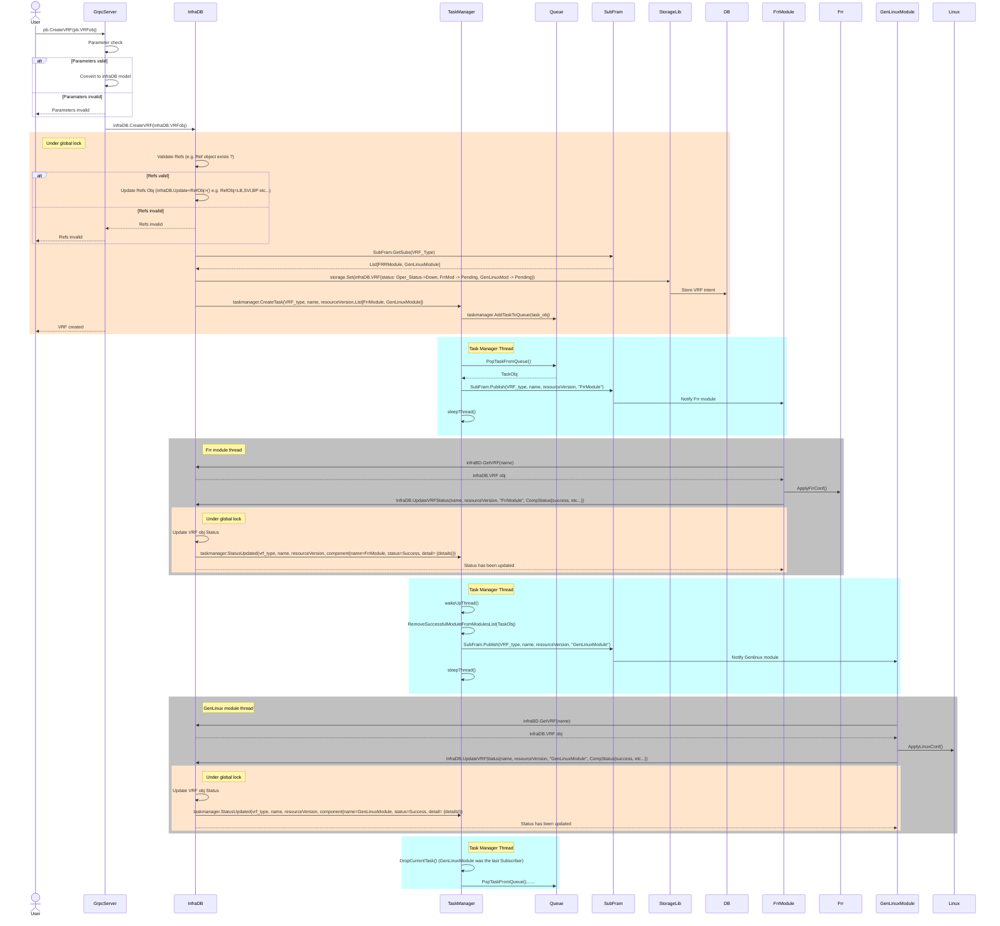

# Create VRF example (Module Success Case)

```mermaid
sequenceDiagram
    actor User as User
    participant GrpcServer as GrpcServer
    participant InfraDB as InfraDB
    participant TaskManager as TaskManager
    participant Queue as Queue
    participant SubFram as SubFram
    participant StorageLib as StorageLib
    participant DB as DB
    participant FrrModule as FrrModule
    participant Frr as Frr
    participant GenLinuxModule as GenLinuxModule
    participant Linux as Linux

    User ->> GrpcServer:pb.CreateVRF(pb.VRFobj) 
    GrpcServer ->> GrpcServer:Parameter check

    alt  Parameters valid
        GrpcServer ->> GrpcServer:Convert to infraDB model
    else Paramaters invalid
        GrpcServer -->> User : Parameters invalid
    end

    GrpcServer ->> InfraDB: infraDB.CreateVRF(infraDB.VRFobj)

rect rgb(255, 229, 204)
    note right of User: Under global lock
    InfraDB ->> InfraDB: Validate Refs (e.g. Ref object  exists ?)

    alt  Refs valid
        InfraDB ->> InfraDB: Update Refs Obj (infraDB.Update<RefObj>() e.g. RefObj=LB,SVI,BP etc...)
    else Refs invalid
        InfraDB -->> GrpcServer: Refs invalid
        GrpcServer -->> User: Refs invalid
    end

    InfraDB ->> SubFram: SubFram.GetSubs(VRF_Type)
    SubFram -->> InfraDB: List[FRRModule, GenLinuxModule] 
    InfraDB ->> StorageLib: storage.Set(infraDB.VRF{status: Oper_Status->Down, FrrMod -> Pending, GenLinuxMod -> Pending})
    StorageLib ->> DB: Store VRF intent
    InfraDB ->> TaskManager: taskmanager.CreateTask(VRF_type, name, resourceVersion,List[FrrModule, GenLinuxModule])
    TaskManager ->> Queue: taskmanager.AddTaskToQueue(task_obj)
    GrpcServer -->> User: VRF created
end

rect rgb(204, 255, 255)
    note right of TaskManager: Task Manager Thread
    TaskManager ->> Queue: PopTaskFromQueue()
    Queue -->> TaskManager: TaskObj
    TaskManager ->> SubFram: SubFram.Publish(VRF_type, name, resourceVersion, "FrrModule")
    SubFram ->> FrrModule: Notify Frr module
    TaskManager ->> TaskManager: sleepThread()
end


rect rgb(192, 192, 192)
    note right of InfraDB: Frr module thread
    FrrModule ->> InfraDB: infraBD.GetVRF(name)
    InfraDB -->> FrrModule: infraDB.VRF obj
    FrrModule ->> Frr: ApplyFrrConf()
    FrrModule ->> InfraDB: InfraDB.UpdateVRFStatus(name, resourceVersion, "FrrModule", CompStatus{success, etc...})

    rect rgb(255, 229, 204)
        note right of InfraDB: Under global lock
        InfraDB ->> InfraDB: Update VRF obj Status
        InfraDB ->> TaskManager: taskmanager.StatusUpdated(vrf_type, name, resourceVersion, component{name=FrrModule, status=Success, detail= {details}})
        InfraDB -->> FrrModule: Status has been updated
    end
end

rect rgb(204, 255, 255)
    note right of TaskManager: Task Manager Thread
    TaskManager ->> TaskManager: wakeUpThread()
    TaskManager ->> TaskManager: RemoveSuccessfulModuleFromModulesList(TaskObj)
    TaskManager ->> SubFram: SubFram.Publish(VRF_type, name, resourceVersion, "GenLinuxModule")
    SubFram ->> GenLinuxModule: Notify Genlinux module
    TaskManager ->> TaskManager: sleepThread()
end


rect rgb(192, 192, 192)
    note right of InfraDB: GenLinux module thread
    GenLinuxModule ->> InfraDB: infraBD.GetVRF(name)
    InfraDB -->> GenLinuxModule: infraDB.VRF obj
    GenLinuxModule ->> Linux: ApplyLinuxConf()
    GenLinuxModule ->> InfraDB: InfraDB.UpdateVRFStatus(name, resourceVersion, "GenLinuxModule", CompStatus{success, etc...})

    rect rgb(255, 229, 204)
        note right of InfraDB: Under global lock
        InfraDB ->> InfraDB: Update VRF obj Status
        InfraDB ->> TaskManager: taskmanager.StatusUpdated(vrf_type, name, resourceVersion, component{name=GenLinuxModule, status=Success, detail= {details}})
        InfraDB -->> GenLinuxModule: Status has been updated
    end
end

rect rgb(204, 255, 255)
    note right of TaskManager: Task Manager Thread
    TaskManager ->> TaskManager: DropCurrentTask() (GenLinuxModule was the last Subscriber)
    TaskManager ->> Queue: PopTaskFromQueue().......
end


```