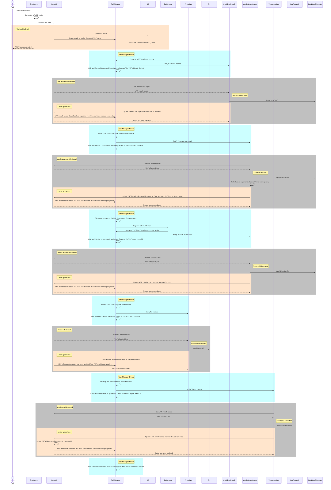

# Requeue failed VRF Task

This sequence diagram explains the process where a module (e.g. Vendor Linux module) fails to apply some configuration to the underline system and therefore the Task needs to be requeued by the Task Manager component. More specifically when an intent gets created in the database (e.g. VRF intent) a corresponding Task also gets created by the Task Manager component and it is pushed in to a Queue of Tasks. When the Task gets dequeued the Task Manager component will send notifications regarding the realization of the Task to the corresponding modules (e.g. General Linux Module, Vendor Linux Module, Frr Module, Vendor Module) sequencially. If a Module fails to realize the Task then the Task gets requeued after a Timer (exponential backoff) gets expired and the failed Module receives a new notification to realize the Task again. If this time the formely failed Module succeeds then the next Module gets notified until the Task is fully realized. In this example here the Module that it fails to realize the Task is the Venodr Linux Module.

