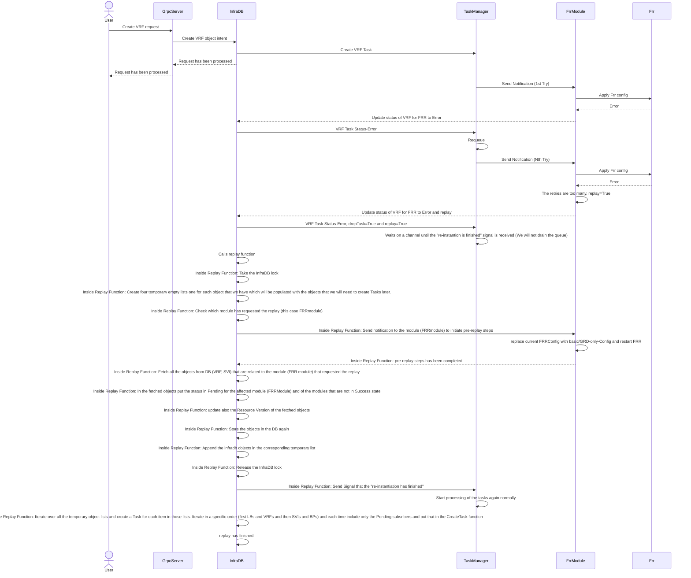

# FRR module - Error (Based on a Create VRF example)

### Notes

- We assume that every time that we are requeuing (how many times until we give up? Do we need counter ?) the FRR returns an error.
- In this Architecture design the Frr module decided if we need to retry or replay (Based on what can take this decision ? The timer ?)
- The already existing Tasks in the queue which are related to FRR module and were there even before the replay will be discarded one by one normally as they correspond to outdated objects. 
- The Tasks that are unrelated to FRR (e.g BridgePort) but are dependent to an FRR related task (e.g. LogicalBridge with VNI) will be errored out and retry until the related object is realized. As our system is idempotent that should work smoothly. 
- The replay function should be agnostic on the modules the modules that we have. It should handle the replay for the module that has requested without having specific knowledge if it is FRRmodule or some other.
-  For the design to work we need to update the FRR Module and issue "save" or equivalent telnet call every time we add additional configuration to the FRR service through telnet

### Open Questions (replay)
1. Should we drain the Queue before we create new tasks for the replay ? This question is related only when we decide to replay all the objects (e.g. VRF,LB,BP,SVI) and not only the ones that are related to FRR (e.g VRF)
2. What happens with the grpc requests that are continue coming during the replay procedure ? (They will not be able to take the lock in infradb as the lock is occupied by the replay function)
3. Based on what do we trigger the replay ? Some counter in the module or some timer value that has existed certain threshold ? If we use Counter where do we keep it ?
4. The system automatically will initiate the replay when is needed. Not the user. Right ?

### Open Questions (General)
1. What happens with objects that are indefinitely in error state ? Should after some reattempts the Task to be dropped ?
2. How do we handle cases where the object is indefinitely in pending state because the module is stuck ? Should after some reattempts drop the Task ?
3. Should we allow force deletion of objects that are permanetly in Error/Pending State ? Do we even want to study this scenario ? is valid ?
4. How do we handle cases where the modules do not return success or error but they return something else ? I this a valid scenario ?

